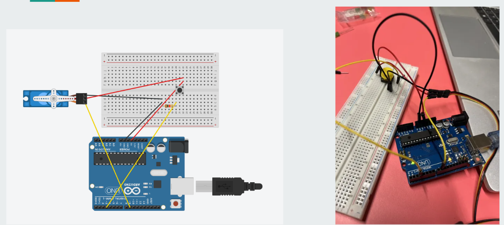
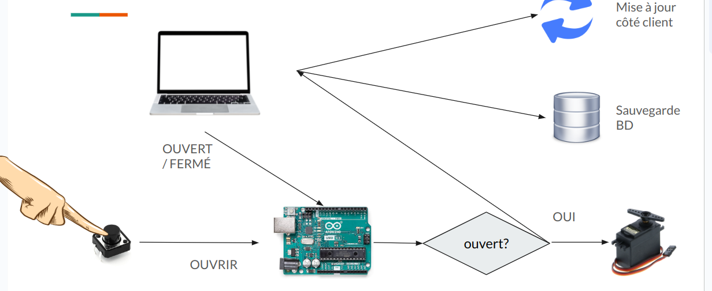

# Projet Arduino Contrôle des Visites  


## Membres du Groupe
- Fouad TEKFA 
- Andoni ALONSO TORT

## Fonctionnement du projet

Avant de lancer le projet ne pas oublier executer d'abord le code arduino. Pour le branchement on a utilisé le schéma suivant :

Faire attention de brancher l'arduino dans son port ttyACM0 pour la communication avec le serveur.



Le fonctionnement du projet est representé dans l'image ci-dessous :



## Lancement du Projet :

Avant de démarrer le projet, assurez-vous de compiler le code Arduino en utilisant l'IDE Arduino ou un autre outil approprié. Une fois que le code Arduino est compilé avec succès, vous pouvez démarrer le projet en exécutant la commande suivante dans votre terminal ou votre invite de commande :

```shell
docker compose up 
```

Cette commande va créer et démarrer les conteneurs Docker pour les services définis dans le fichier docker-compose.yml. Voici les services utilisés dans ce projet :
- **Service Web (web) :** Ce service utilise l'image `node:20` 
Il expose les ports 3000 et 8083 


- **Base de Données MongoDB (mongo) :** Ce service utilise l'image `mongo:latest` pour exécuter une instance de la base de données MongoDB. Il expose le port 27017 pour la communication avec l'application. 

Une fois que les conteneurs sont démarrés, vous pouvez accéder à l'application en ouvrant votre navigateur web et en allant à l'adresse http://localhost:3000.

## Arrêt et Suppression

Pour arrêter et supprimer les conteneurs Docker créés par Docker Compose, exécutez la commande suivante :

```shell
docker compose down
```


